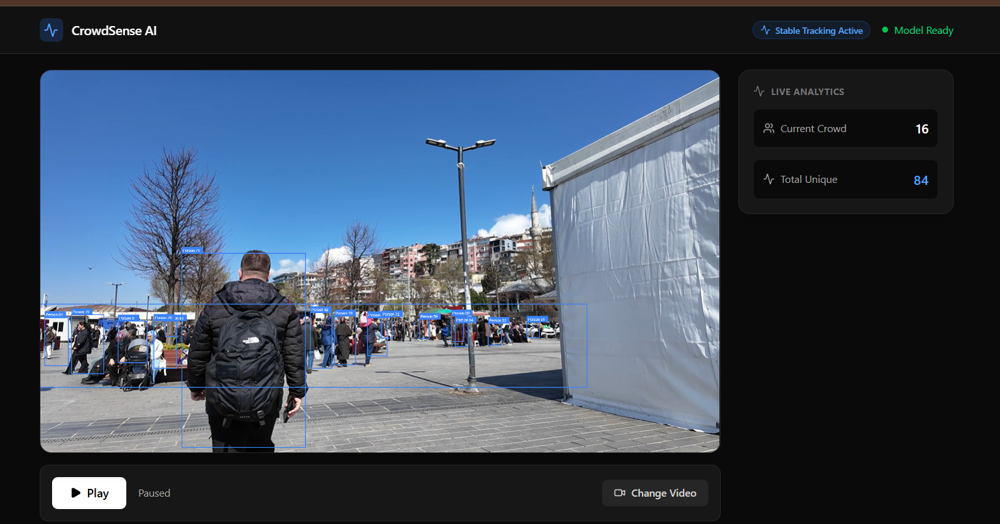
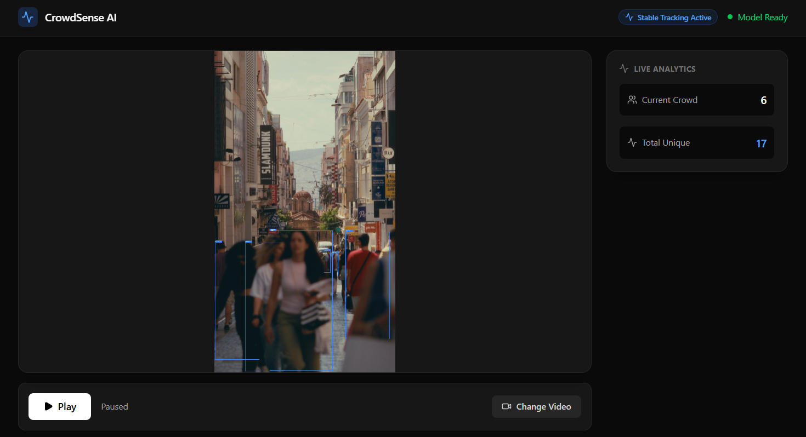
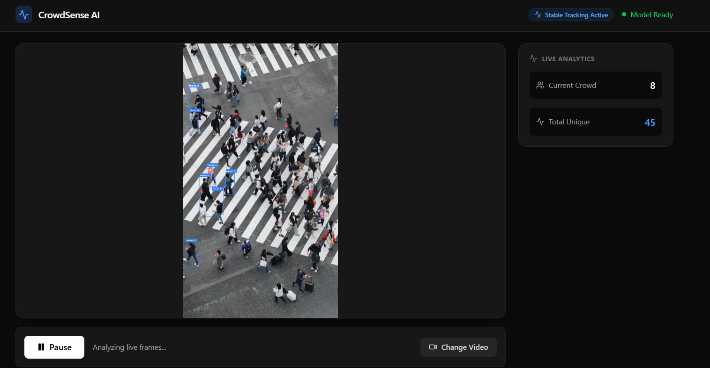

# CrowdSense: Unified Crowd Analytics Platform

This repository contains a comprehensive suite of production-style industrial computer vision and analytics systems focused purely on real-time crowd perception, tracking, predictive modeling, and intelligent interventions (like smart ad targeting). It is built using YOLO, OpenCV, PyTorch, React, and MongoDB.

--------------------------------------------------

## Dev/Creator

## Dev/Creator: Senthil

--------------------------------------------------

## 1. Smart Crowd Panic Detection & Analytics

Industrial safety and surveillance system for real-time crowd monitoring, anomaly detection, and predictive flow.

- Human detection and tracking
- Crowd density and motion pattern analysis
- Panic and anomaly detection
- Predictive modeling for future crowd flows
- Heatmap generation and risk scoring

**Use case:** Public safety, disaster prevention, stadium monitoring, and surveillance systems

--------------------------------------------------

## 2. Intelligent Ad Targeting System

A smart intervention engine that leverages real-time crowd demographics to serve optimized contextual advertising.

- Dynamic gender and demographic estimation
- Real-time ad swapping based on crowd majority
- Engagement analytics and logging

**Use case:** Smart billboards, retail analytics, and digital out-of-home (DOOH) advertising

--------------------------------------------------

## 3. Generative AI Reporting

Leverages Large Language Models to automatically summarize massive amounts of crowd and ad data into readable reports.

- Automatic daily summaries of peak crowd times
- Security anomaly briefings
- Generated actionable insights from MongoDB

**Use case:** Executive dashboards and daily venue management briefs

--------------------------------------------------

## Tech Stack

- **Core Vision:** Python 3.11+, YOLO (Ultralytics), OpenCV, PyTorch, NumPy, Supervision
- **Backend & API:** Flask, FastAPI, SocketIO, Scikit-learn
- **Database:** MongoDB (PyMongo)
- **Frontend Dashboard:** React, TypeScript, Vite, Tailwind CSS

--------------------------------------------------

## Features

- Real-time industrial crowd vision pipelines
- Edge-to-Cloud architecture with live WebSocket streaming
- GPU acceleration support with CPU fallback
- Multi-object detection, tracking, and ReID potential
- Heatmaps, risk visualization, and cinematic HUD-style overlays
- Generative AI & Predictive modeling for venue reporting
- Production-grade system design

--------------------------------------------------

## How It Works (Screenshots)

Below is a look at the CrowdSense interface in action during real-time video analysis:

### 1. Main Dashboard View

*The main control panel where you can upload and stream live video feeds.*

### 2. Live Detection & Tracking

*Real-time YOLOv8 bounding boxes tracking individuals and estimating crowd density.*

### 3. Analytics & Ad Engine

*The system instantly calculates risk levels and triggers smart advertisements based on crowd demographics.*

--------------------------------------------------

## Installation & Setup

1. **Prerequisites**
   Ensure you have Python 3.12+ and Node.js installed on your system.

2. **Backend Setup**
   Open a terminal and navigate to the `backend` folder:
   ```bash
   cd backend
   pip install -r ../requirements.txt
   pip install flask-cors
   python -m spacy download en_core_web_sm
   ```
   *(Note: Ensure you configure your `GEMINI_API_KEY` in `backend/.env` for AI Reporting).*

3. **Frontend Setup**
   Open a second terminal and navigate to the `frontend` folder:
   ```bash
   cd frontend
   npm install
   ```

--------------------------------------------------

## How to Run

1. **Start the Backend Server**
   In your backend terminal:
   ```bash
   python app.py
   ```
   *The Flask API will start on `http://127.0.0.1:5000`.*

2. **Start the Frontend Dashboard**
   In your frontend terminal:
   ```bash
   npm run dev
   ```
   *The React dashboard will start (usually on `http://localhost:3000`).*

3. **Analyze Video**
   Open the frontend link in your browser, click **Browse**, and upload one of the provided `.mp4` videos from the `sample_videos` folder to begin real-time crowd analysis.

--------------------------------------------------

## Goal

To build an industry-leading, unified AI platform that seamlessly integrates crowd perception stacks with real-time analytics and predictive interventions.

--------------------------------------------------

## Note

This repository is intended for advanced research, industrial prototyping, and deployment. Ensure proper privacy compliance (e.g., GDPR) when deploying person-tracking features in public spaces.
